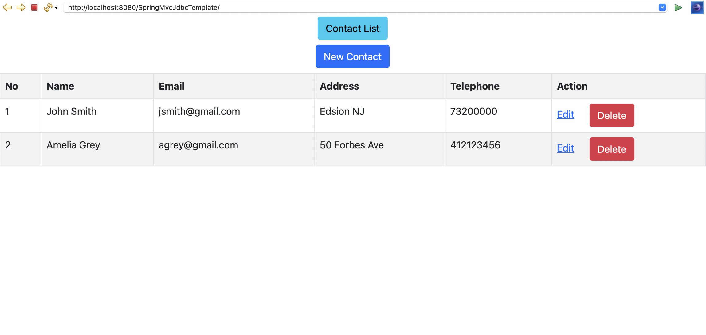
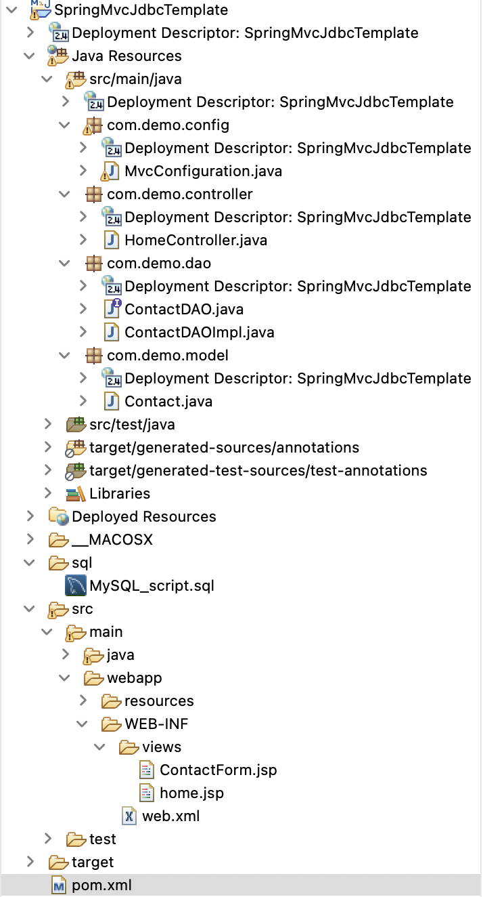
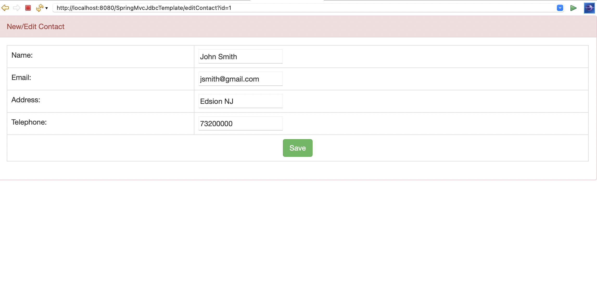

# spring-mvc-jdbc

This project integrate JDBC in a Spring MVC application. The application manages a contact list that looks like this: 



The following pieces of software/technologies are used in this application:
- Java 8
- Spring Tool Suite 4
- Spring framework 5.1
- JSTL 1.2
- MySQL Database 8.0
- Maven 3.2
- Bootstrap 5.1

This is the project structure:



In the `pom.xml` file, it adds dependencies configuration to the project. 
```
<?xml version="1.0" encoding="UTF-8"?>
<project xmlns="http://maven.apache.org/POM/4.0.0" xmlns:xsi="http://www.w3.org/2001/XMLSchema-instance" xsi:schemaLocation="http://maven.apache.org/POM/4.0.0 http://maven.apache.org/xsd/maven-4.0.0.xsd">
	<modelVersion>4.0.0</modelVersion>

	<groupId>net.codejava.spring</groupId>
	<artifactId>SpringMvcJdbcTemplate</artifactId>
	<version>1.0</version>
	<packaging>war</packaging>

	<name>SpringMvcJdbcTemplate</name>
	<url>http://maven.apache.org</url>

	<properties>
		<java.version>1.8</java.version>
		<spring.version>5.1.4.RELEASE</spring.version>
		<cglib.version>2.2.2</cglib.version>
	</properties>

	<dependencies>
		<!-- Spring core & mvc -->
		
		<dependency>
			<groupId>org.springframework</groupId>
			<artifactId>spring-webmvc</artifactId>
			<version>${spring.version}</version>
		</dependency>
		<dependency>
			<groupId>org.springframework</groupId>
			<artifactId>spring-orm</artifactId>
			<version>${spring.version}</version>
			<type>jar</type>
			<scope>compile</scope>
		</dependency>

		<!-- CGLib for @Configuration -->
		<dependency>
			<groupId>cglib</groupId>
			<artifactId>cglib-nodep</artifactId>
			<version>${cglib.version}</version>
			<scope>runtime</scope>
		</dependency>


		<!-- Servlet Spec -->
		<dependency>
			<groupId>javax.servlet</groupId>
			<artifactId>javax.servlet-api</artifactId>
			<version>3.1.0</version>
			<scope>provided</scope>
		</dependency>
		<dependency>
			<groupId>javax.servlet.jsp</groupId>
			<artifactId>javax.servlet.jsp-api</artifactId>
			<version>2.3.1</version>
			<scope>provided</scope>
		</dependency>
		<dependency>
			<groupId>jstl</groupId>
			<artifactId>jstl</artifactId>
			<version>1.2</version>		
		</dependency>
		
		<dependency>
    <groupId>mysql</groupId>
    <artifactId>mysql-connector-java</artifactId>
    <version>8.0.15</version>
</dependency>

	</dependencies>

	<build>
		<plugins>
			<plugin>
				<groupId>org.apache.maven.plugins</groupId>
				<artifactId>maven-compiler-plugin</artifactId>
				<version>3.2</version>
				<configuration>
					<source>1.8</source>
					<target>1.8</target>
				</configuration>
			</plugin>
		</plugins>
	</build>
</project>

```

In `Contact.java`, it maps a row in the `contact` table to a plain old Java object (POJO). 

In `ContactDAOImpl.java`, it implements methods for performing CRUD operations on the `contact` table. It declares a `JdbcTemplate` and a `DataSource` object is injected via the constructor. 
```
private JdbcTemplate jdbcTemplate;
	
public ContactDAOImpl(DataSource dataSource) {
    jdbcTemplate = new JdbcTemplate(dataSource);
}
```


In `MvcConfiguration.java`, it uses Java-based classes and annotations to configure this Spring MVC application. The `getDataSource()` method returns a configured `DataSource` bean. And the `getContactDAO()` method returns an implementation of the `ContactDAO` interface, which is the `ContactDAOImpl` class. This bean will be injected to the controller class as below.
```
package com.demo.config;

import javax.sql.DataSource;

import org.springframework.context.annotation.Bean;
import org.springframework.context.annotation.ComponentScan;
import org.springframework.context.annotation.Configuration;
import org.springframework.jdbc.datasource.DriverManagerDataSource;
import org.springframework.web.servlet.ViewResolver;
import org.springframework.web.servlet.config.annotation.EnableWebMvc;
import org.springframework.web.servlet.config.annotation.ResourceHandlerRegistry;
import org.springframework.web.servlet.config.annotation.WebMvcConfigurerAdapter;
import org.springframework.web.servlet.view.InternalResourceViewResolver;

import com.demo.dao.ContactDAO;
import com.demo.dao.ContactDAOImpl;

@Configuration
@ComponentScan(basePackages="com.demo")
@EnableWebMvc
public class MvcConfiguration extends WebMvcConfigurerAdapter{

	@Bean
	public ViewResolver getViewResolver(){
		InternalResourceViewResolver resolver = new InternalResourceViewResolver();
		resolver.setPrefix("/WEB-INF/views/");
		resolver.setSuffix(".jsp");
		return resolver;
	}
	
	@Override
	public void addResourceHandlers(ResourceHandlerRegistry registry) {
		registry.addResourceHandler("/resources/**").addResourceLocations("/resources/");
	}

	@Bean
	public DataSource getDataSource() {
		DriverManagerDataSource dataSource = new DriverManagerDataSource();
		dataSource.setDriverClassName("com.mysql.cj.jdbc.Driver");
		dataSource.setUrl("jdbc:mysql://localhost:3306/novjava?serverTimezone=UTC");
		dataSource.setUsername("root");
		dataSource.setPassword("password");
		
		return dataSource;
	}
	
	@Bean
	public ContactDAO getContactDAO() {
		return new ContactDAOImpl(getDataSource());
	}
}

```

To enable Spring MVC for our Java web application, update the web deployment descriptor file `web.xml` as below:
```
<?xml version="1.0" encoding="UTF-8"?>
<web-app version="2.4" xmlns="http://java.sun.com/xml/ns/j2ee"
	xmlns:xsi="http://www.w3.org/2001/XMLSchema-instance"
	xsi:schemaLocation="http://java.sun.com/xml/ns/j2ee http://java.sun.com/xml/ns/j2ee/web-app_2_4.xsd">
	<display-name>SpringMvcJdbcTemplate</display-name>
	<context-param>
		<param-name>contextClass</param-name>
		<param-value>
			org.springframework.web.context.support.AnnotationConfigWebApplicationContext
		</param-value>
	</context-param>
	<listener>
		<listener-class>org.springframework.web.context.ContextLoaderListener</listener-class>
	</listener>

	<servlet>
		<servlet-name>SpringDispatcher</servlet-name>
		<servlet-class>org.springframework.web.servlet.DispatcherServlet</servlet-class>
		<init-param>
			<param-name>contextClass</param-name>
			<param-value>
				org.springframework.web.context.support.AnnotationConfigWebApplicationContext
			</param-value>
		</init-param>
		<init-param>
			<param-name>contextConfigLocation</param-name>
			<param-value>com.demo</param-value>
		</init-param>
		<load-on-startup>1</load-on-startup>
	</servlet>
	<servlet-mapping>
		<servlet-name>SpringDispatcher</servlet-name>
		<url-pattern>/</url-pattern>
	</servlet-mapping>

	<session-config>
		<session-timeout>30</session-timeout>
	</session-config>
</web-app>
```

In the Spring Controller class `HomeController.java`, I use the `@Autowired` annotation to let Spring inject an instance of the `ContactDAO` implementation into this controller automatically. Each handler method uses this `contactDAO` object to perform necessary CRUD operations.
```
package com.demo.controller;

import java.io.IOException;
import java.util.List;

import javax.servlet.http.HttpServletRequest;

import org.springframework.beans.factory.annotation.Autowired;
import org.springframework.stereotype.Controller;
import org.springframework.web.bind.annotation.ModelAttribute;
import org.springframework.web.bind.annotation.RequestMapping;
import org.springframework.web.bind.annotation.RequestMethod;
import org.springframework.web.servlet.ModelAndView;

import com.demo.dao.ContactDAO;
import com.demo.model.Contact;

@Controller
public class HomeController {

	@Autowired
	private ContactDAO contactDAO;
	
	@RequestMapping(value="/")
	public ModelAndView listContact(ModelAndView model) throws IOException{
		List<Contact> listContact = contactDAO.list();
		model.addObject("listContact", listContact);
		model.setViewName("home");
		
		return model;
	}
	
	@RequestMapping(value = "/newContact", method = RequestMethod.GET)
	public ModelAndView newContact(ModelAndView model) {
		Contact newContact = new Contact();
		model.addObject("contact", newContact);
		model.setViewName("ContactForm");
		return model;
	}
	
	@RequestMapping(value = "/saveContact", method = RequestMethod.POST)
	public ModelAndView saveContact(@ModelAttribute Contact contact) {
		contactDAO.saveOrUpdate(contact);		
		return new ModelAndView("redirect:/");
	}
	
	@RequestMapping(value = "/deleteContact", method = RequestMethod.GET)
	public ModelAndView deleteContact(HttpServletRequest request) {
		int contactId = Integer.parseInt(request.getParameter("id"));
		contactDAO.delete(contactId);
		return new ModelAndView("redirect:/");
	}
	
	@RequestMapping(value = "/editContact", method = RequestMethod.GET)
	public ModelAndView editContact(HttpServletRequest request) {
		int contactId = Integer.parseInt(request.getParameter("id"));
		Contact contact = contactDAO.get(contactId);
		ModelAndView model = new ModelAndView("ContactForm");
		model.addObject("contact", contact);
		
		return model;
	}
}
```

`home.jsp` is the home page that displays the contact list as well as action links for creating new, editing and deleting a contact. It applies JSTL and EL expressions. The contact form page `ContactForm.jsp` displays details of a contact for creating new or updating old one. It uses `Spring form tags` to bind the values of the form to a model object. Here is how it looks like




